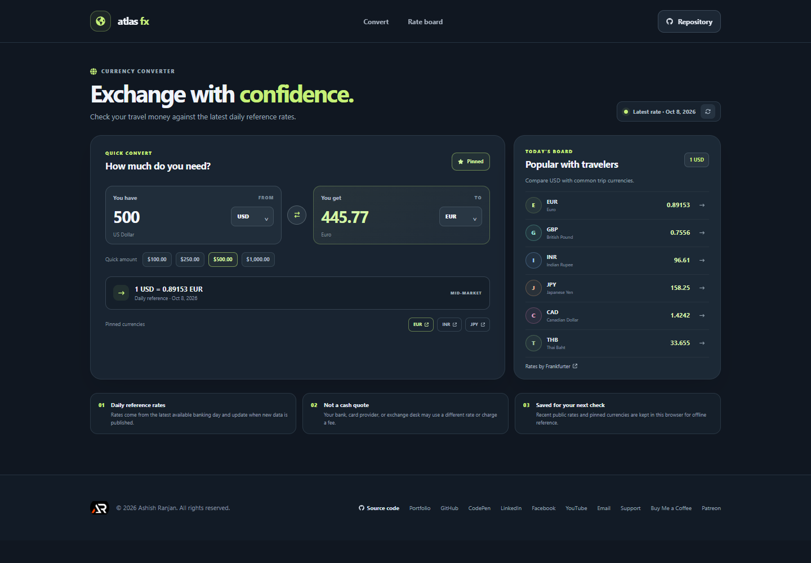

# Atlas FX

Atlas FX converts a travel amount between popular currencies and shows the reference rate used. It also includes a compact board of common travel currencies and lets you pin codes for quick comparisons.

**Live app:** [https://a2rp.github.io/travel-currency-converter/](https://a2rp.github.io/travel-currency-converter/)

## What is included

- Live conversion for 21 currencies, including USD, EUR, GBP, INR, JPY, CAD, AUD, CHF, MXN, SGD, THB, NZD, SEK, NOK, BRL, ZAR, KRW, CNY, HKD, PHP, and PLN.
- A source amount, destination amount, currency selectors, and a one-click swap control.
- Quick amount buttons for common travel totals.
- A reference-rate line with its published date and a refresh control.
- A popular-currencies board that updates when the source currency changes.
- Pinned currencies saved in this browser for quick comparisons.
- A small local cache of the latest successful rate set, with a saved-rate fallback when the network is unavailable.
- Responsive layout, fixed navigation, a repository link, social links, and a back-to-top button.

## Using the converter

Enter an amount in **You have**, then choose its currency. Choose the currency you want to receive in **You get**. The converted amount and rate line update when the latest available reference rate has loaded. Use the swap button to reverse the pair. Choose a quick amount or a currency from the rate board to update the conversion. Pin or unpin the selected destination to keep it in the quick-comparison row. Use the refresh button to request the latest available rates again.

Rates are fetched from the public [Frankfurter v2 API](https://frankfurter.dev/), which provides daily exchange-rate data without an API key. Rates reflect the latest available banking day, not a live trading quote. A bank, card provider, or exchange desk may apply a different rate or fees. If a rate request fails, Atlas FX uses the last successful rates saved in this browser when available. Pinned currencies and public rate data are stored locally; the amount you enter is not saved. The converter needs a network connection for rates it has not cached yet.

## Run locally

Use Node.js 22 or later and npm.

```sh
npm ci
npm run dev
```

Open the local address printed by Vite. Before publishing, check the app with:

```sh
npm run lint
npm run build
```

## Deployment

The project uses Vite with the `/travel-currency-converter/` base path and publishes its production build to GitHub Pages through `gh-pages`.

```sh
npm run deploy
```

The deployed app is available at [https://a2rp.github.io/travel-currency-converter/](https://a2rp.github.io/travel-currency-converter/).

## Future improvements

Ideas not implemented yet:

- Add currency search and a locale-aware amount input.
- Add historical rate charts and a date selector.
- Let people organize and rename several quick-comparison sets.
- Add optional provider selection and a printable travel exchange summary.

## Links

- Portfolio: [https://www.ashishranjan.net](https://www.ashishranjan.net)
- GitHub: [https://github.com/a2rp](https://github.com/a2rp)
- CodePen: [https://codepen.io/ash1198](https://codepen.io/ash1198)
- LinkedIn: [https://www.linkedin.com/in/aashishranjan](https://www.linkedin.com/in/aashishranjan)
- Facebook: [https://www.facebook.com/theash.ashish/](https://www.facebook.com/theash.ashish/)
- YouTube: [https://www.youtube.com/@ashishranjan-ashz?sub_confirmation=1](https://www.youtube.com/@ashishranjan-ashz?sub_confirmation=1)
- Email: [mailto:ash.ranjan09@gmail.com](mailto:ash.ranjan09@gmail.com)

## Support

- Support: [https://a2rp-donation-page.netlify.app/](https://a2rp-donation-page.netlify.app/)
- Buy Me a Coffee: [https://buymeacoffee.com/ashishranjan](https://buymeacoffee.com/ashishranjan)
- Patreon: [https://www.patreon.com/ashishranjan](https://www.patreon.com/ashishranjan)
